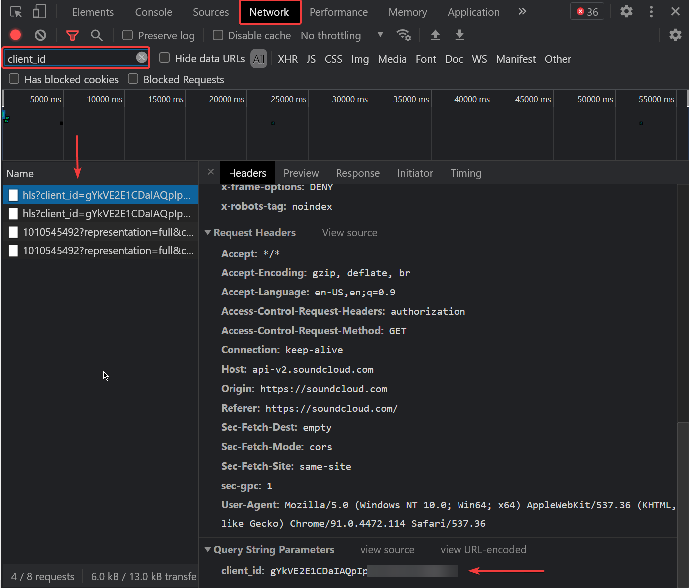

A [SoundCloud](https://soundcloud.com/) API wrapper, easy to use all accessable with just a token. You can view all examples [here](./test)

> NOTE: `*` means it is required 

### How to find your SoundCloud token
> Go to [SoundCloud](https://soundcloud.com) open console and look for the 'Network' tab. Once found make any request on SoundCloud or refresh the page and search for 'client_id', click one of the requests scroll down and Voilà.


### Creating a Client
> Contents you will need

Name | Type | Description
---- | ---- | -----------
client_id* | String | The 'token' you will be needing

```js
const { SoundCloud } = require('soundcloud-api-wrapper');

const soundcloudClient = new SoundCloud({
    client_id: 'CLIENT_ID'
});
```

### Searching for a Track
> Contents you will need

Name | Type | Description
---- | ---- | -----------
query* | String | The search query
limit | Number | The amount of results you want

```js
...

const track = client.request.searchTrack({
    query: 'hello world',
    limit: 3
});

// NOTE: track> returns a Promise
// NOTE: If limit is added it will return an array of results, unless it is less than 1 or 1.
```

### Creating a Streaming url
```js
...

// For one track
const streamUrl = client.request.createStream(track.media.stream);

// NOTE: streamUrl returns a Promise
// NOTE: track can both return a single Object or an Array of objects.
```

### Creating a Music bot
> NOTE: This example is added [here](./test)

```js
const track = await soundcloud.request.searchTrack({
    query: args.join(' ')
});

const stream = await soundcloud.request.createStream(track.media.stream);

const voiceChannel = msg.member.voice.channel;
const connection = await voiceChannel.join();
const dispatcher = await connection.play(stream);

...
```